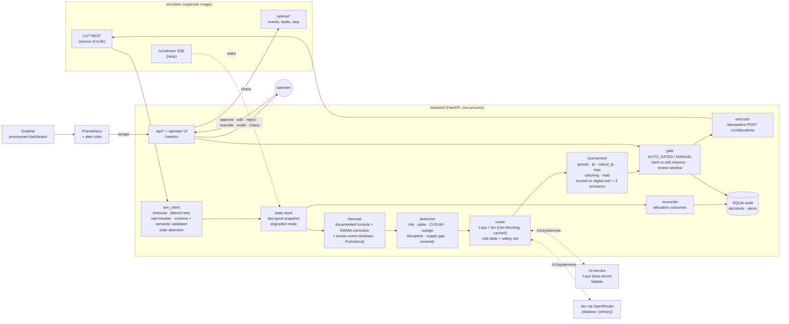

# Architecture

Everything here operates on the **BUP Fuel Supply Simulator** (simulated data only).

## Loop (every tick, driven by SSE with a 2 s polling fallback)

| Step | Component | On failure |
|---|---|---|
| Observe | `sim_client` + `state` (9 parallel GETs) | Retries, then the breaker opens. The last good snapshot is served in **degraded** mode, with no auto-execution. |
| Validate | pydantic schemas + semantic checks | Reject the response, raise the `sim_invalid_response` alert, keep the last good snapshot |
| Predict | `forecast.py` | Keep the previous corrections if demand-history fails |
| Detect | `detect.py` | n/a (pure) |
| Route | `router.py` → Laya/Jev in the background | Rule table (model down, slow, unconfigured, auth rejected, or out-of-range answer) |
| Decide | `solvers.tournament` on the twin | A failing solver is dropped, and the others still compete |
| Gate | `orchestrator._gate` | Hard reasons wait for a human. Soft reasons open a 2-tick review window, then auto-execute. |
| Act | idempotent POSTs `fo-<decision>-<i>` | 409 codes mapped per the guide. Replays are safe. |
| Reconcile | `_reconcile` | Recorded outcomes feed the audit trail and router accuracy |

## Deployment

`docker compose up` runs: `simulator` → `backend` (:8080) ← `ml-service` (Laya); `prometheus` (:9090, alert rules); `grafana` (:3000, dashboard provisioned as the home page). The backend depends on nothing at runtime. Without the simulator it serves cached state; without Laya it uses the rule router.

CI ([.github/workflows/ci.yml](../.github/workflows/ci.yml)) runs: tests + twin benchmark → promtool/compose/dashboard checks → build → deploy the real simulator image + backend + Prometheus → health gate → **twin calibration against the real image** → crisis run → load test with a fault phase → evidence artifacts.
